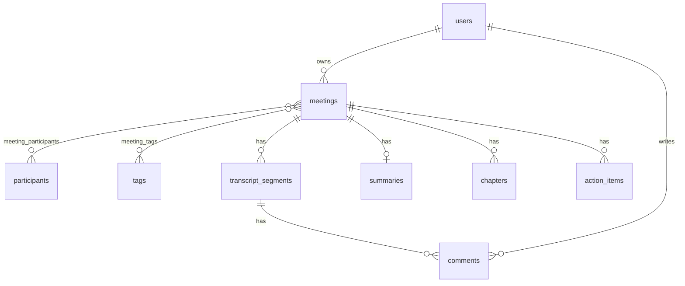

# Fireflies.ai Clone — Meeting Notes & Transcripts

A full-stack clone of the [Fireflies.ai](https://fireflies.ai) meeting assistant. Browse a library of meetings, open an
interactive transcript that stays in sync with a media player, read AI-generated summaries, outlines and action items,
ask questions about a meeting ("AskFred"), and search across every transcript.

> Built as an SDE full-stack assignment. Not affiliated with Fireflies.ai.

| | |
|---|---|
| **Frontend** | Next.js 16 (App Router) · TypeScript · Tailwind CSS v4 · SWR · lucide-react |
| **Backend** | Python · FastAPI · SQLAlchemy 2 (ORM) · Pydantic v2 |
| **Database** | SQLite |
| **AI** | Built-in rule-based summarizer (default, works offline) · optional Claude via the Anthropic SDK |
| **Tests** | pytest: parser, summarizer, end-to-end API, and every sample transcript file |

---

## Features

**Core**
- **Meetings library**: grouped by day (Today / Yesterday / date), with title, time, duration, source, tags, open tasks and participant avatars. Search (title, participant or transcript text), filters for date range, participant and tag, and newest/oldest sorting.
- **Meeting page**:
  - **Interactive transcript** with speaker avatars and timestamps.
  - **Media player bar**: play/pause, ±15s, speed control, a mute button, and a seek bar coloured by who is speaking. **Play makes sound:** the browser reads the transcript aloud, with a different voice per speaker.
  - **Two-way sync**: clicking a line seeks the player, and playback highlights and auto-scrolls the transcript.
  - **Search inside the transcript** with highlighted matches and ↑/↓ navigation.
  - Keyboard shortcuts: Space plays/pauses, ←/→ skip 5s.
- **AI notes**: keywords, overview bullets, a clickable outline (chapters) and action items. Notes can be regenerated.
- **CRUD**:
  - Create a meeting by uploading a `.txt` / `.vtt` / `.srt` / `.json` transcript or pasting text.
  - Edit title, date, participants and tags.
  - Delete a meeting, which cascades to everything it owns.
  - Add, edit, complete and delete action items.
- **Fireflies experience**: sidebar and top-bar layout, modals, dropdown menus, toasts, empty and loading states, Settings, and "Coming soon" placeholders for the live meeting bot, integrations, teams, billing and auth.

**Bonus**
- **AskFred**: ask a question about a meeting; answers cite transcript lines you can jump to.
- **Global search** across every meeting. Results deep-link to the exact moment (`/meetings/3?t=262.4`).
- **Comments** on individual transcript lines.
- **Export** notes and transcript as Markdown or plain text.
- **Tags**, with filtering by tag.
- **Speaker analytics**: talk-time share, turns and words per minute.
- **Dark mode**, with no flash on reload.
- **Home dashboard**: stats, recent meetings, and open action items across all meetings.

---

## Quick start

Requirements: **Python 3.10+** and **Node.js 20+**.

### One command (macOS, Linux and Windows)

```bash
./start.sh        # macOS / Linux
start.cmd         # Windows (Command Prompt), or .\start.cmd in PowerShell
```

Both commands run the same launcher, [`scripts/start.mjs`](scripts/start.mjs). It's written in Node.js using only Node's built-in modules, so it behaves the same on every OS.

- **What it does:** creates the Python virtualenv and installs packages, runs `npm install`, and creates `frontend/.env.local`. It only redoes these when something is missing or `requirements.txt` / `package-lock.json` changed.
- **Starting:** it starts both servers with `[backend]` / `[frontend]` labelled logs, waits until both respond, then prints the URLs.
- **Stopping:** **Ctrl+C** stops both servers, including their child processes. If one of them crashes, the other is stopped too.
- **Before starting:** it checks that ports 8000 and 3000 are free and tells you if they're not.

| Command (macOS/Linux · Windows) | Use |
|---|---|
| `./start.sh` · `start.cmd` | Start the app (<http://localhost:3000>, API docs at <http://localhost:8000/docs>) |
| `./start.sh --reset` · `start.cmd --reset` | Reset the database to the 7 demo meetings, then start |
| `./start.sh --open` · `start.cmd --open` | Also open the app in your browser |
| `./start.sh --help` · `start.cmd --help` | Show all options |

**Other ports:** `BACKEND_PORT=8001 FRONTEND_PORT=3001 ./start.sh`, or in PowerShell
`$env:BACKEND_PORT=8001; $env:FRONTEND_PORT=3001; .\start.cmd`. The frontend is pointed at the right backend
automatically.

**Note:** Next.js allows only one dev server per `frontend/` folder, so stop a running copy before starting another.

### Manual setup

#### 1. Backend (FastAPI, port 8000)

```bash
cd backend
python3 -m venv .venv
source .venv/bin/activate            # Windows: .venv\Scripts\activate
pip install -r requirements.txt
uvicorn app.main:app --reload --port 8000
```

On first start the app creates `backend/fireflies.db` and seeds **7 demo meetings** with full transcripts, summaries,
chapters, action items and comments. Interactive API docs: <http://localhost:8000/docs>

```bash
python -m app.seed      # reset the database to the demo data at any time
python -m pytest -q     # run the backend tests (76 tests)
```

#### 2. Frontend (Next.js, port 3000)

```bash
cd frontend
npm install
cp .env.example .env.local           # NEXT_PUBLIC_API_URL=http://localhost:8000
npm run dev
```

Open <http://localhost:3000>.

### Optional: real LLM summaries

Set `ANTHROPIC_API_KEY` before starting the backend. New meetings, **Regenerate** and AskFred will then use Claude
(`claude-opus-5-5`, override with `ANTHROPIC_MODEL`). Without a key, or if a call fails, the app falls back to the
built-in rule-based summarizer, so it always works.

### Try it

- Upload any file from [`samples/`](samples/): 13 realistic meetings in every format (including a 1-hour all-hands), 7 edge cases, and 3 invalid files that should be rejected. See [samples/README.md](samples/README.md). You can also use **Upload → Paste transcript → Use a sample transcript**.
- Open a meeting, click any transcript line and watch the player and transcript stay in sync.
- Search "pilot" or "Okta" in the top bar and click a result to jump to that moment.

---

## Architecture

```
┌─────────────────────────── Browser ───────────────────────────┐
│ Next.js (App Router) — pages + React components               │
│   SWR cache  ──►  lib/api.ts (typed fetch client)             │
└───────────────────────────────┬───────────────────────────────┘
                                │ JSON over HTTP (REST, /api/*)
┌───────────────────────────────▼───────────────────────────────┐
│ FastAPI                                                       │
│   routers/   HTTP layer: params, status codes, validation     │
│   schemas.py Pydantic request/response models                 │
│   services/  business logic                                   │
│     meeting_service · transcript_parser · summarizer          │
│     llm (optional Claude) · assistant · search · exporter     │
│   models.py  SQLAlchemy ORM models  ──►  SQLite               │
└───────────────────────────────────────────────────────────────┘
```

**Request flow, e.g. creating a meeting:** `NewMeetingModal` reads the file in the browser and sends `POST /api/meetings`
with the raw transcript. FastAPI validates the body with `MeetingCreate`, and the router calls
`meeting_service.create_meeting()`. That parses the transcript into timed segments (`transcript_parser`), links
participants and tags (get-or-create), generates notes (`llm` if configured, otherwise `summarizer`), and saves
everything in one transaction. The response is the full `MeetingDetail`, and the UI navigates to the new meeting.

**Design decisions**
- **Thin routers, logic in services.** Routers only deal with HTTP. Parsing, summarizing, search and export are plain Python functions that are easy to unit-test.
- **The player is a "virtual clock" with a text-to-speech voice.** There is no recording behind a transcript, so `usePlayer` advances `currentTime` on a timer, and `useSpeechPlayback` reads the active line aloud with the browser's built-in Web Speech API: one voice per speaker, speech rate fitted to the line's time slot, restarted on seek, stopped on pause. It needs no API key or audio files. `usePlayer` exposes the same interface as an `<audio>` element (`currentTime`, `play`, `seek`, `speed`), so a real recording could replace it later.
- **AI is pluggable with a fallback.** `generate_notes()` tries Claude when a key is set and falls back to deterministic heuristics on any error. Claude responses use structured outputs (a Pydantic schema), so they are always valid JSON.
- **Client-side data fetching with SWR.** Pages are client components that fetch from FastAPI. After a mutation the UI updates the SWR cache locally (or revalidates the lists), which keeps it snappy without a global state library.
- **Auth is mocked in one place.** `deps.get_current_user()` returns the seeded default user. Adding real auth only means changing that dependency.

### Project structure

```
backend/
  app/
    main.py              FastAPI app, CORS, startup (create tables + seed)
    database.py          engine, session factory, SQLite foreign-key pragma
    models.py            SQLAlchemy models = the database schema
    schemas.py           Pydantic request/response schemas
    deps.py              shared dependencies (current user, 404 helpers)
    routers/             meetings · action_items · comments · workspace (me, search, lookups)
    services/
      meeting_service.py   list/create/update meetings, notes orchestration
      transcript_parser.py .txt / .vtt / .srt / .json → timed segments
      summarizer.py        rule-based keywords, overview, chapters, action items
      llm.py               optional Claude integration (structured outputs)
      assistant.py         AskFred question answering
      search.py            global transcript search
      exporter.py          Markdown / text export
      timeutils.py         "01:23" ⇄ seconds
    seed/                seed.py + data/*.json (7 demo meetings)
  tests/                 pytest: parser, summarizer, API
frontend/src/
  app/                   routes: / · /meetings · /meetings/[id] · /search · /settings · /integrations · /analytics · /team
  components/
    layout/              AppShell, Sidebar, Topbar, ThemeToggle, CaptureModal
    meetings/            MeetingRow, MeetingFilters, NewMeetingModal, EditMeetingModal
    meeting/             MeetingDetailView, MeetingHeader, NotesPanel, SummaryTab, ActionItems,
                         AskFred, SpeakerStats, TranscriptPanel, TranscriptLine, PlayerBar
    search/              SearchResults
    ui/                  Button, Modal, ConfirmDialog, Menu, Toast, Avatar, ChipInput, Highlight, ...
  hooks/                 usePlayer (virtual media clock), useSpeechPlayback (reads transcript aloud), useDebouncedValue
  lib/                   api.ts (typed client), types.ts, format.ts, theme.ts
start.sh / start.cmd     one command to set up and start backend + frontend (macOS/Linux / Windows)
scripts/start.mjs        the cross-platform launcher both of them run (Node.js, built-ins only)
samples/                 test transcripts: every format + edge cases + a long-meeting generator (see samples/README.md)
```

---

## Database schema



| Table | Columns | Notes |
|---|---|---|
| `users` | id, name, email *(unique)*, created_at | The default logged-in user |
| `meetings` | id, owner_id → users, title, started_at *(indexed)*, duration_seconds, source, created_at, updated_at | `source`: google_meet / zoom / teams / upload / paste |
| `participants` | id, name *(unique)*, email | Shared contact directory, reused across meetings |
| `meeting_participants` | meeting_id → meetings, participant_id → participants | Join table (composite PK), many-to-many |
| `tags` | id, name *(unique)*, color | |
| `meeting_tags` | meeting_id → meetings, tag_id → tags | Join table (composite PK), many-to-many |
| `transcript_segments` | id, meeting_id → meetings *(indexed)*, position, speaker, start_time, end_time, text | One row per utterance; times in seconds |
| `summaries` | id, meeting_id → meetings *(unique, 1:1)*, overview, keywords *(JSON)*, generated_by, created_at | `generated_by`: seed / heuristic / llm |
| `chapters` | id, meeting_id → meetings *(indexed)*, title, start_time, summary | The outline |
| `action_items` | id, meeting_id → meetings *(indexed)*, text, assignee, timestamp, is_completed, created_at, updated_at | `timestamp` links a task to the moment it was said |
| `comments` | id, segment_id → transcript_segments *(indexed)*, user_id → users, body, created_at | Comments on transcript lines |

- **Integrity:** every child foreign key uses `ON DELETE CASCADE` (SQLite foreign keys are switched on with `PRAGMA foreign_keys=ON`), and the ORM relationships use `cascade="all, delete-orphan"`. Deleting a meeting therefore removes its segments, summary, chapters, action items, comments and join rows.
- **Normalization:** participants and tags are shared entities linked through join tables, so filtering "all meetings with Priya" or "all Sales meetings" is a simple `EXISTS` query.
- **Deliberate denormalization:** `transcript_segments.speaker` is plain text rather than a foreign key. Uploaded transcripts often contain labels like "Speaker 2", and a transcript is a historical record that shouldn't change when someone edits the participant list.
- **Keywords as JSON:** they are always read and written together with the summary and never queried on their own, so a JSON column is simpler than another table.

---

## API overview

All endpoints are under `/api`. Interactive docs: `/docs` (Swagger) and `/redoc`.

| Method | Endpoint | Description |
|---|---|---|
| GET | `/meetings` | List meetings. Query params: `q` (title / participant / transcript text), `participant`, `tag`, `date_from`, `date_to`, `sort=newest\|oldest`, `limit` |
| POST | `/meetings` | Create from a transcript `{title, started_at?, participants[], tags[], transcript, filename?, source}` → 201 + full meeting. 422 if the transcript can't be parsed |
| GET | `/meetings/{id}` | Full meeting: participants, tags, summary, chapters, action items, transcript segments with comments |
| PATCH | `/meetings/{id}` | Partial update: `title`, `started_at`, `participants[]`, `tags[]` |
| DELETE | `/meetings/{id}` | Delete (cascades) → 204 |
| POST | `/meetings/{id}/summary` | Regenerate AI notes from the transcript (keeps user-edited action items) |
| GET | `/meetings/{id}/export?format=md\|txt` | Download notes and transcript |
| POST | `/meetings/{id}/ask` | AskFred `{question}` → `{answer, sources[], generated_by}` |
| GET | `/action-items?status=open\|completed\|all` | Action items across all meetings (Home dashboard) |
| POST | `/meetings/{id}/action-items` | Add an action item `{text, assignee?, timestamp?}` |
| PATCH | `/action-items/{id}` | Edit / complete `{text?, assignee?, timestamp?, is_completed?}` |
| DELETE | `/action-items/{id}` | Delete → 204 |
| POST | `/segments/{id}/comments` | Comment on a transcript line `{body}` |
| DELETE | `/comments/{id}` | Delete a comment → 204 |
| GET | `/search?q=` | Global search, grouped by meeting |
| GET | `/me`, `/participants`, `/tags`, `/health` | Current user, filter options, health check |

Errors use FastAPI's standard shape: `{"detail": "Meeting not found"}` (404), validation errors (422).

### Supported transcript formats

| Format | Example |
|---|---|
| Plain text | `[00:01:23] Alice: Hello` · `00:01:23 Alice: Hello` · `Alice (01:23): Hello` · `Alice: Hello` (times estimated at ~150 wpm) |
| WebVTT | cue timings + `<v Alice>Hello` or `Alice: Hello` |
| SRT | numbered cues + `Alice: Hello` |
| JSON | `[{"speaker": "Alice", "start": "00:05" or 5, "end"?: 9, "text": "Hello"}]` or `{"segments": [...]}` |

Consecutive caption cues from the same speaker are merged into one transcript line.

---

## Assumptions & scope

- **No real speech-to-text or recording.** Meetings come from seeded data or uploaded/pasted transcripts, and audio/video upload is shown as "Coming soon".
- **The media player is simulated** (the assignment allows a placeholder): a clock driven by the transcript timestamps. The sound comes from the browser's text-to-speech reading the transcript, not from a recording. It works in Chrome, Edge and Safari; in a browser without speech voices, playback is silent and the mute button is disabled. The Anthropic API key has nothing to do with audio.
- **Single default user** ("Jordan Rivera"). Authentication, teams/sharing, integrations, the live meeting bot, billing and notification settings are placeholders.
- **Times are stored as naive local datetimes.** It's a single-user demo, so there's no timezone handling.
- **The rule-based "AI" is extractive.** Summaries pick the most representative sentences, and action items come from commitment phrases ("I'll…", "can you…", "by Friday"). Seeded meetings have hand-written notes to show the intended quality, and setting an Anthropic key turns on real LLM notes.
- **Search uses SQL `LIKE`**, which is fine for a demo-sized dataset. At scale I'd switch to SQLite FTS5 or Postgres full-text search, or embeddings for semantic search.
- **Seed dates are relative to the first startup**, so the library always looks recent.

## Deployment notes

- **Backend** (e.g. Render or Railway): build with `pip install -r requirements.txt`, start with `uvicorn app.main:app --host 0.0.0.0 --port $PORT`. Set `CORS_ORIGINS` to the frontend URL. SQLite lives on the instance disk; a free tier without a persistent disk resets to the seed data on restart.
- **Frontend** (e.g. Vercel): root directory `frontend`, env var `NEXT_PUBLIC_API_URL=https://<your-backend>`.
